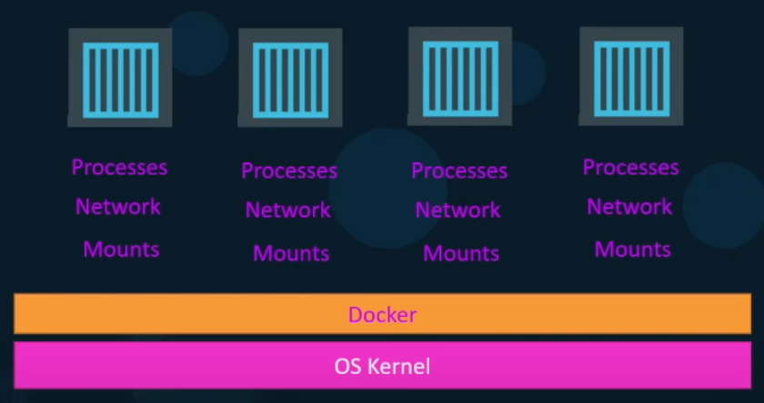

# Docker
---
## Containers

Sistema de containers para rodar softwares sem problemas de versionamentos e sistemas operacionais.



## Sharing the kernel

O Docker compartilha o kernel do sistema do computador (Linux, Windows), e pode rodar outros sistemas baseados nesses kernels (Ubuntu, Fedora). 


Um Docker rodando numa máquina Linux não consegue criar um container Windows. Um Docker no Windows consegue criar um container Linux apenas se rodar uma VM. 


## Images x Container

**Image**: Pacote ou template, usado para criar um ou mais containers

**Containter**: São instâncias de Imagens que estão isoladas e tem seus próprios ambientes e processos

Time de DevOps usa a imagem Docker que é criada a partir do projeto para fazer o deploy da aplicação.


## Ports

Quando rodamos um container com Docker, esse ele gera um IP para o container que só pode ser acessado pelo host do container. Dessa forna, se quisermos acessar de um local externo, temos que mapear uma porta do nosso servidor para apontar para uma porta do container. Usamos a flag -p com a porta do servidor e a porta dentro do container.


## Layered Architecture

O Docker usa uma arquitetura em camadas, onde ele vai cacheando os passos que ele roda. Dessa forma, se um Dockerfile muda somente uma parte do código, o que vem acima não roda novamente, usando-se o que foi cacheado. Outros Dockerfiles tb podem usar os mesmos caches, se os passos forem iguais.


Quando montamos a imagem, as camadas geradas são apenas *read-only*, enquanto quando rodamos com o comando *run*, criamods uma camadas que guarda dados e vive enquanto a aplicação estiver rodando.


## Volumes

Quando criamos um container e alteramos algo *read-only*, na verdade estamos criando uma cópia dessa coisa para a parte *read-write* e modificando essa parte. Quando queremos persistir dados de um container, que não são apagados quando excluímos o container, usamos os volumes.

`docker volume create data_volume`

Este comando cria uma pasta em */var/lib/docker/volumes/*

Então podemos montar essa pasta a uma pasta interna do container, com: 

```
docker run -v data_volume:/var/lib/mysql mysql

ou 

docker run --mount type=bind,source=/data/mysql,target=/var/lib/mysql mysql
```

## Docker Compose

Conseguimos linkar container rodando simultaneamente com a flag *--link*, como linkando uma aplicação a um banco de dados, por exemplo:

```
docker run -d --name=redis redis
docker run -d --name=vote -p 5000:80 --link redis:redis voting-app
```

Com docker compose, ficaria em yaml:

```
version: 2
services:
  redis:
    image: redis
  vote:
    image: voting-app
    ports:
      - 5000:80
    depends_on:
      - redis
```
