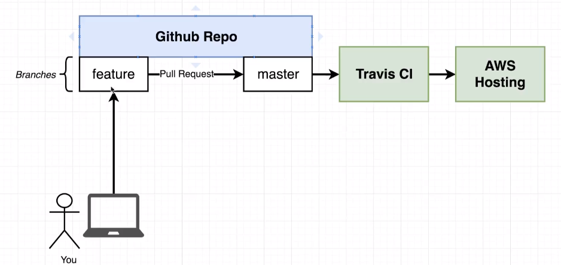
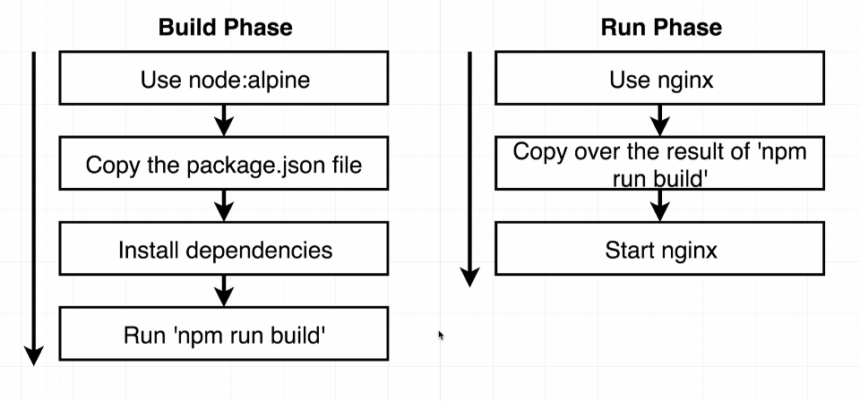

# Production workflow

Development workflow we will use:

1. Branch *feature* is initialized;
2. After code is complete, a pull request is made to *master*
3. A continues intagration app called Travis CI is called for a battery of tests
4. If tests pass, the code is pushed to a AWS Hosting

We will build a react project. It take the following commands:

**Development**
~~~
npm run start
~~~

**Tests**
~~~
npm run test
~~~

**Production**
~~~
npm run build
~~~

## Development
### custom build
To build a custom developer file:

~~~
docker build -f Dockerfile.dev .
~~~

### volumes
Docker volumes references to a specific file, just like the ports that we pointed:

~~~
docker run -p [local-port]:[container-port] -v [local-folder]:[container-folder] [container-id]
docker run -p [local-port]:[container-port] -v /app/modules -v $(pwd):/app [container-id]

~~~

- **-v**: this sets the pastes we want to copy the volumes, before and after the ':'. We can also use this flag to say that we don't want to map a especif folder, like the */app/modules*.

### copy x docker-compose

Using docker-compose, we don't need the COPY in the Dockerfile because docker-compose takes care of copying those files. But its ok to leave it there, in case one day we don't use docker compose itself. That way, Dockerfile would still work properly.

## Tests

There are two ways to run the tests of an application. Both have their ups and downs.

- Inside docker-compose: we can add a *service* to docker-compose in order to run our tests inside the container. This will run the tests automatically, but will not let us manipulate the tests.

~~~
  tests:
    build:
      context: .
      dockerfile: Dockerfile.dev
    volumes:
      - /app/node_modules
      - .:/app
    command: ["npm", "run", "test"]
~~~

- In the terminal: we can run the test in our terminal with *exec*, and interact with the tests throught our terminal. This way is more flexible, but need the command to ben ran and the container id.

~~~
docker exec -it [container-id] [test-commands]
~~~

## Production

In the developer environment we have a *Dev server* that communicates with the browser, connecting to the html/js files. In production mode, that server does not exist, because is not appropriate to be running in a production environment.
This way, we need a *Production server* like [Nginx](https://www.nginx.com/). It takes incoming traffic and routing/responding it to some static files. So, we will need another Dockerfile for production with Nginx inside.

Steps: 

1. Use node:alpine image
2. Copy the package.json file
3. Install dependencies
4. Run 'npm run build'
5. Start nginx

### multi-step process
Using *node:alpine* and *nginx* images will need a two step build phase.

